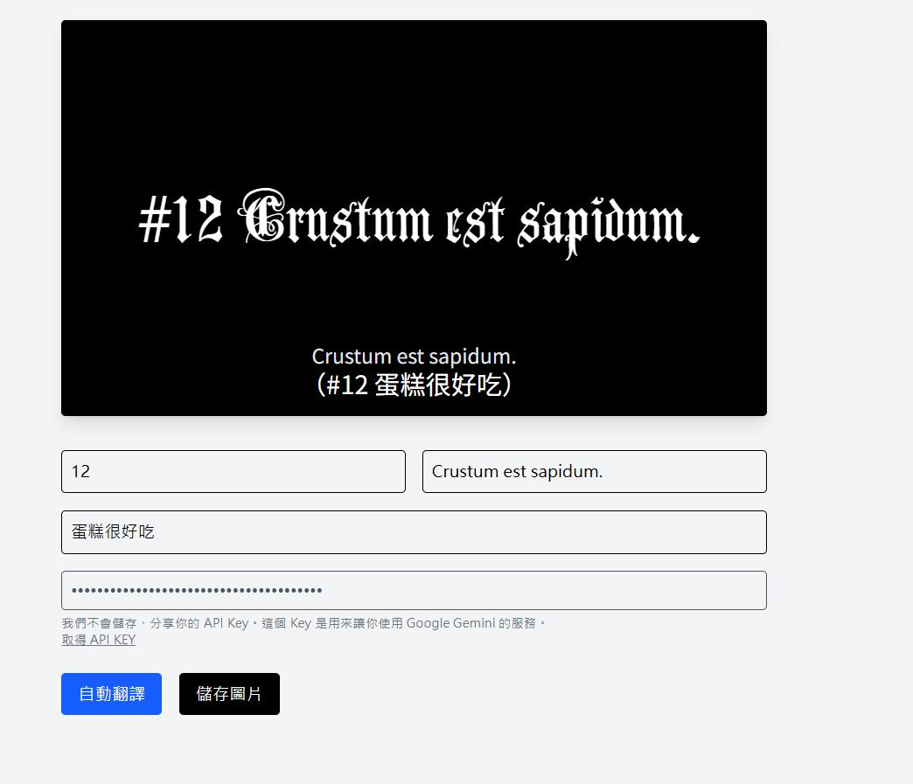

# 🌟 ave-mujica-generator

> ✨ A minimalist Latin subtitle image generator with auto-translation via Google Gemini API  
> ✨ 一款極簡風格的拉丁文字幕圖片產生器，支援自動翻譯與圖片匯出

---

## 🌐 Test Website | 線上體驗

🔗 [https://sam3u7858.github.io/ave-mujica-generator](https://sam3u7858.github.io/ave-mujica-generator)

> 📌 部署於 GitHub Pages，建議使用桌機與 Chrome 瀏覽最佳體驗

---

## 📸 Preview

 

---

## ✨ Features 特點

- 🧠 **Auto Translate** 自動翻譯中文 → 古典拉丁文（支援自填 Gemini API Key）
- 🎨 **Dynamic Preview** 自動調整字體大小，確保美觀排版
- 💬 **Bilingual Subtitles** 顯示拉丁文原文、副標與對應中文
- 🖼️ **Image Export** 匯出 PNG 字幕圖像（黑底劇場風格）
- 🔐 **Local API Key** 本地儲存 API Key，不會上傳或紀錄任何內容

---
Font: [AnglicanText](https://www.1001fonts.com/anglicantext-font.html)  
License: Free for commercial use (FFC by 1001fonts.com)

```bash
git clone https://github.com/yourname/ave-mujica-generator.git
cd ave-mujica-generator
